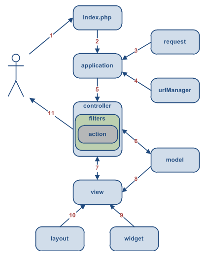

MVC 概览
============

> 注意：此章节还在开发中。

Yii 实现了 model(模型)-view(视图)-controller(控制器) (MVC) 设计模式，MVC 广泛应用于 web 和 应用程序项目。
MVC 的目标是分离用户界面和业务逻辑，提升代码重用性,让开发人员更易于改变应用程序的单个组件,而不会干扰和影响其他部分。

MVC中的 *model(模型)* 代表信息(数据)和数据依附的业务规则。 *view(视图)*包含用户界面元素，如文本,图片和表单等。 *controller(控制器)* 管理模型和视图的通信，就好像中介一样。

Yii 除了实现MVC设计模式，还引入了一个前端控制器 *front-controller*，叫
*application*(应用)。前端控制器封装了请求相关的信息（ *execution context* ）。即，前端控制器收集有关用户请求的信息，然后分发到适当的控制器去真正处理该请求。换句话说，前端控制器是应用程序的主管理器，接收所有的请求，并委派给相应的控制器动作 （action）处理。

下图显示了一个 Yii 应用的静态结构：

典型工作流程
------------------

下图展示了 Yii 应用处理用户请求的典型工作流程：

1. 用户发起一个请求：访问URL `http://www.example.com/index.php?r=post/show&id=1` 。
   Web服务器通过执行启动脚本 `index.php` 来捕获这个请求。
2. 启动脚本创建并运行一个 [[yii\web\Application|Application]] 应用实例。
3. 应用实例通过 `request` 应用组件获取这个用户请求的详细信息。
4. 应用确定处理请求的具体[控制器](controller.md)和动作，这个过程需要`urlManager` 组件来协助完成。
   该例中，控制器是`post`，指向 `PostController`类，动作是`show`，其实际意义由控制器决定。
5. 应用创建了被请求的控制器实例来进一步处理用户请求。
   控制器确定 `show` 这个动作指向控制器类中的 `actionShow` 方法。
   然后应用创建并执行与此动作相关联的过滤器（如访问控制，基准测试）。
   如果过滤器允许执行该动作（如用户有执行此动作的权限），此动作就被执行。
6. 动作使用底层数据表中ID值为`1`的那条记录，创建了一个`Post` [模型](model.md) 的实例。
7. 然后动作渲染了一个名叫`show`的 [视图](view.md) ，来输出展现`Post`模型实例。
8. 视图读取 `Post` 模型实例的属性，并显示这些属性的值。
9. 视图同时也执行一些[小部件](view.md#widgets)。
10. 视图渲染结果——即前面几步的输出——嵌入 [布局](view.md#layout)，就创建了一个完整的页面。
11. 到此，动作正式完成视图渲染并给用户显示完整页面。